## CREATE THE CA
+ Go to "System/Certificates/Authorities" 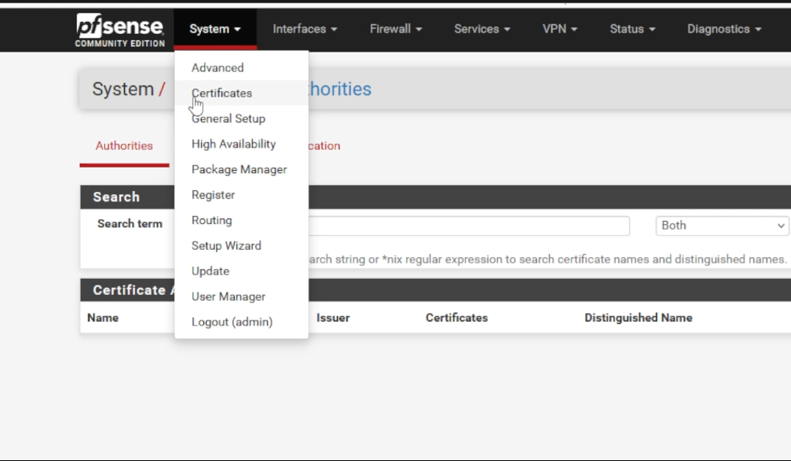 
+ Click "Add"
+ We only need to modify the following values:
1) **Create/Edit CA | Descriptive Name**: Use anything you wish
2) **Internal Certificate Authority | Lifetime**: 365
4) **Internal Certificate Authority | Common Name**: Use anything you wish
+ Click "Save"

## CREATE THE SERVER SIDE CERTIFICATE
+ You should be in "System/Certificate/Authorities"
+ Click on the "Certificates" tab 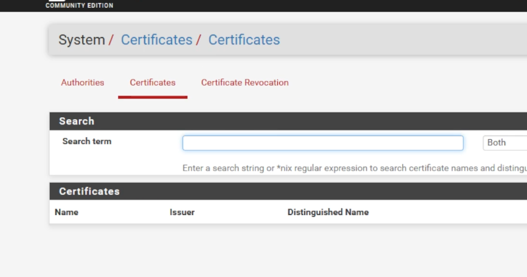 
+ Click "Add"
+ We only need to modify the following values:
1) **Add/Sign a New Certificate | Descriptive Name**: Use anything you wish
2) **Internal Certificate | Lifetime**: 365
3) **Internal Certificate | Common Name**: Use anything you wish
4) **Certificate Attributes | Certificate Type**: Server Certificate
+ Click "Save"

## CREATE THE OPENVPN USER
+ You should be in "System/Certificate/Certificates"
+ Click on "System/User Manager" 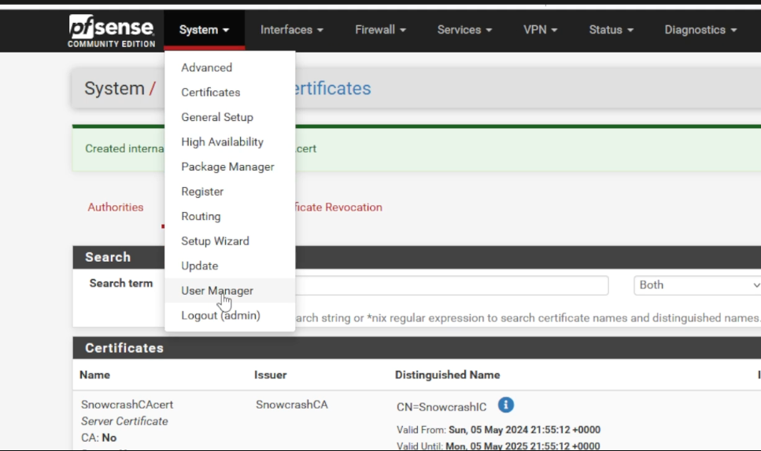 
+ Click on "Add"
+ You only need a username and a password here
+ Click "Save"

## CREATE THE OPENVPN USER CERTIFICATE
+ You should be in "System/User Manager/Users"
+ Click on "System/Certificates" 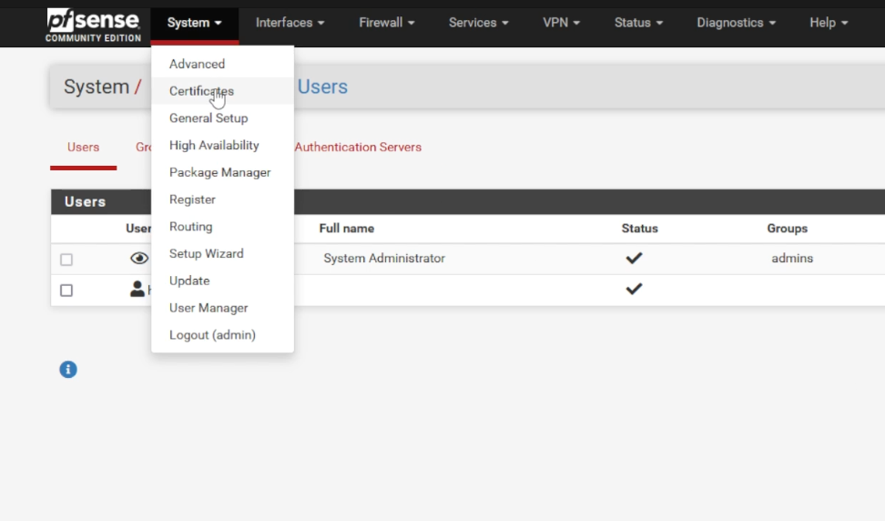 
+ Click on the "Certificates" tab 
+ Click "Add"
+ We only need to modify the following values:
1) **Create/Edit CA | Descriptive Name**: Use anything you wish
2) **Internal Certificate Authority | Lifetime**: 365
3) **Internal Certificate Authority | Common Name**: Use anything you wish
4) Click "Save"

## CREATE THE OPENVPN SERVER
+ You should be in "System/Certificates/Certificates"
+ Click on "VPN/OpenVPN" 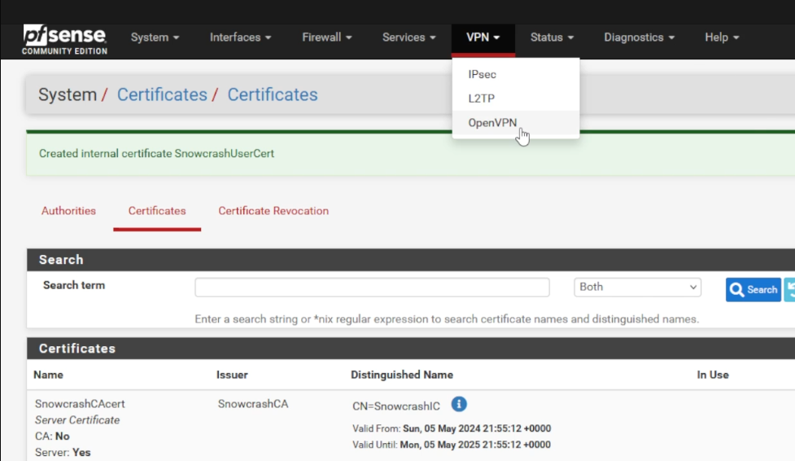 
+ You should be in the "Servers" tab
+ Click "Add"
+ We only need to modify the following values:
1) **General Information | Description**: Use anything you wish
2) **Mode Configuration | Server Mode**: Remote Access(SSL/TLS)
3) **Cryptographic Settings | Server Certificate**: Use server side certificate created earlier
4) **Tunnel Settings | IPv4 Tunnel Network**: Use a subnet not already on the local network
5) **Tunnel Settings | Redirect IPv4 Gateway**: Checked (enables full tunnel mode)
6) **Advanced Configuration | UDP Fast I/O**: Checked
7) **Advanced Configuration | Gateway creation**: IPv4 Only
+ Click "Save"

## VERIFY OPENVPN SERVER IS ACTIVE
+ You should be in "VPN/OpenVPN/Servers"
+ Click on "Status\System Logs" 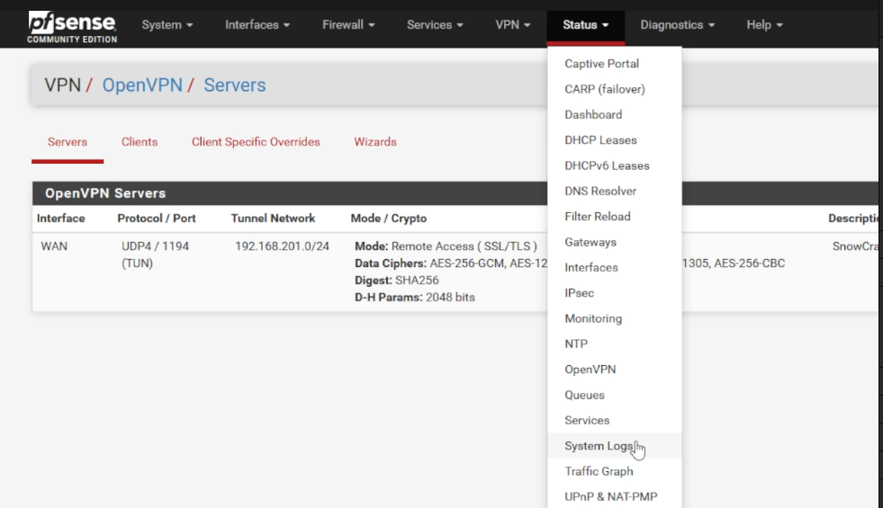 
+ Click on the "OpenVPN" Tab 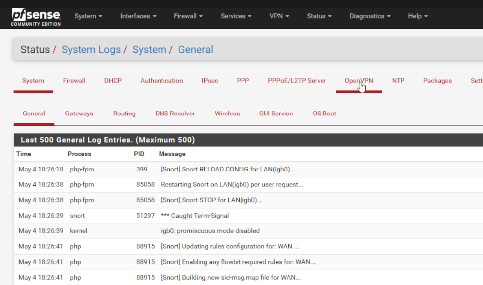 
+ Scroll down and look for "Initialization Sequence Completed" 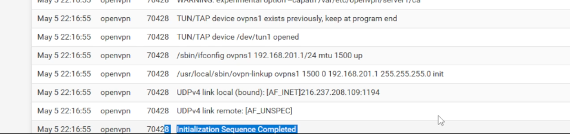 

## CREATE FIREWALL RULES
+ You should be in "Status/System Logs/OpenVPN"
+ Click on "Firewall\Rules" 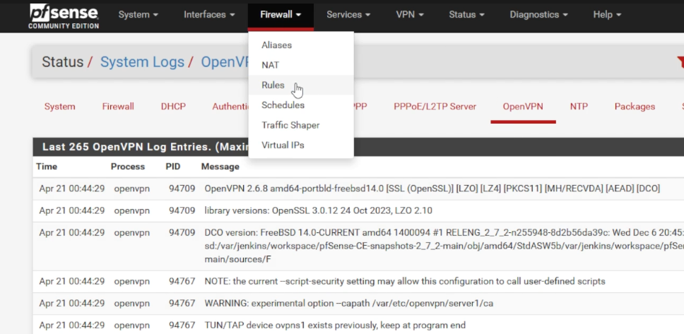 
+ Click on the "OpenVPN" tab 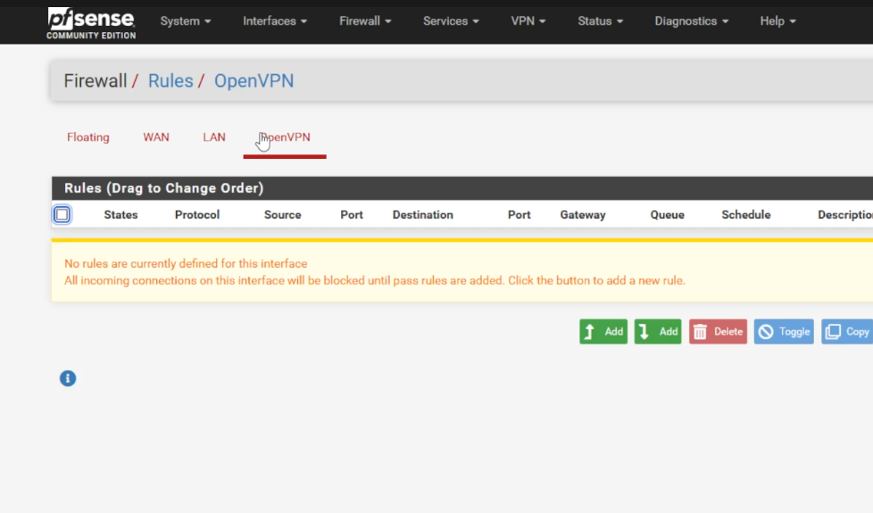 
+ Click on "Add"
+ We only need to modify the following values:
1) **Edit Firewall Rule | Protocol**: Any
2) **Source | Source**: Network -> <Use subnet created in "CREATE THE OPENVPN SERVER">
3) **Extra Options | Description**: Use anything you wish
+ Click "Save"
+ Click "Apply Changes"
+ You should be in "Firewall\Rules\OpenVPN"
+ Click the "WAN" tab 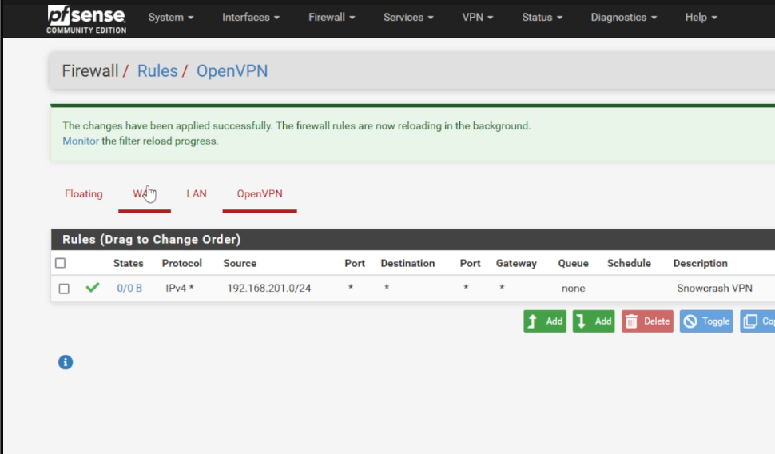 
+ Click "Add"
+ We only need to modify the following values:
1) **Edit Firewall Rule | Protocol**: UDP
2) **Destination | Destination**: WAN Address
3) **Destination | Destination Port Range**: Set "From" and "To" both to "OpenVPN"
+ Click "Save"
+ Click "Apply Changes"

## INSTALL OPENVPN CLIENT CONFIGURATION EXPORT UTILITY
+ You should be in "Firewall/Rules/WAN"
+ Click on "System\Package Manager" 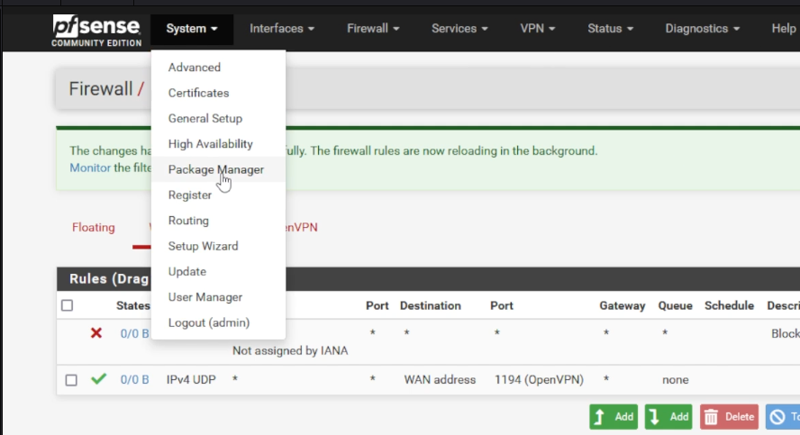 
+ Click on the "Available Packages" tab 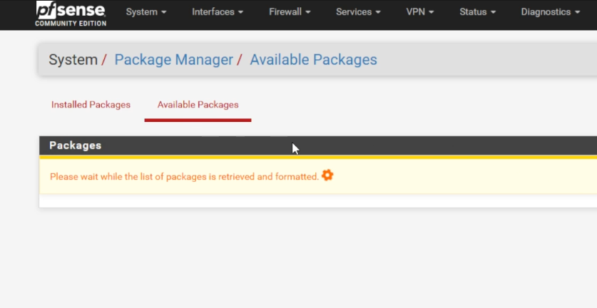 
+ Search for "openvpn-Client-export"
+ Click "Install"
+ Click "Confirm"

## EXPORT THE CLIENT CONFIGURATION 
+ You should be in "System/Package Manager/Package Installer"
+ Click "VPN\OpenVPN" 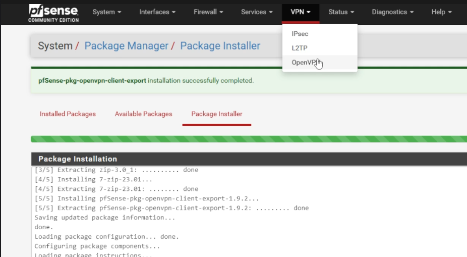 
+ Click on the "Client Export" tab 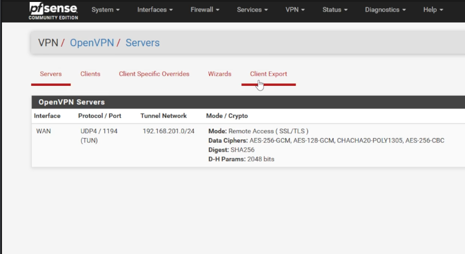 
+ Scroll down to "OpenVPN Clients" 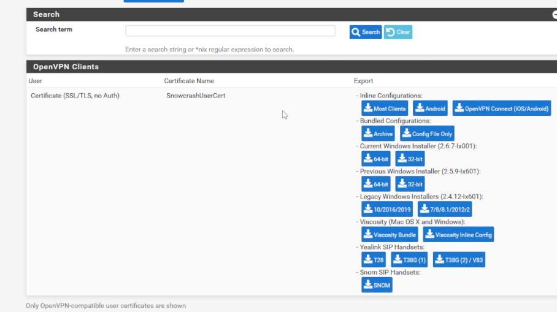 
+ Export the configuration per your client needs

From here you are ready to load up the configuration and connect to your OpenVPN server

